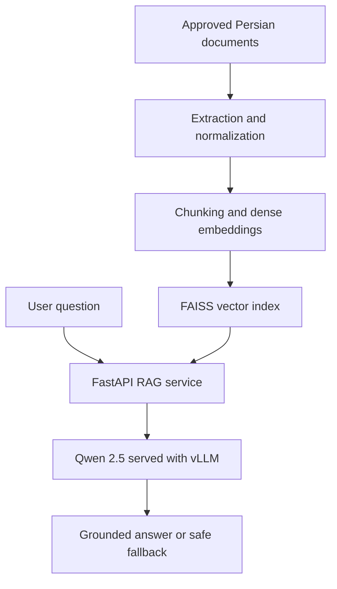

# Persian User RAG Chatbot

A production-oriented Retrieval-Augmented Generation (RAG) assistant designed to answer Persian user questions from approved, domain-specific sources.

The project was developed in the context of **Saman Salamat (Saman Insurance Group)** for a health-insurance platform. It combines semantic retrieval with a Persian-capable large language model to provide useful answers while reducing hallucinations and keeping responses grounded in company-approved documents.

> This public repository is a sanitized project overview. Internal documents, datasets, credentials, deployment configuration, and proprietary source code are intentionally excluded.

## The Problem

Important user information was distributed across multiple Persian resources, including:

- Frequently asked questions
- Privacy policies
- Terms and conditions
- User guidance documents
- Health-related PDF documents

A general-purpose chatbot could respond fluently, but it could also generate unsupported or outdated information. In a health-insurance setting, a confident but incorrect answer is not acceptable.

The goal was therefore to build an assistant that:

1. retrieves the most relevant information from approved sources;
2. answers in clear Persian using only the retrieved context;
3. avoids unsupported claims; and
4. returns a safe fallback when the available evidence is insufficient.

## Key Capabilities

- Persian text extraction, cleaning, and normalization
- Configurable document chunking and metadata preservation
- Dense semantic retrieval using a FAISS vector index
- Context-grounded response generation with Qwen 2.5
- Confidence-based rejection for low-quality retrieval
- Safe fallback when an answer is not present in the sources
- REST API integration for web and mobile clients
- Separate API and model-serving layers
- Rebuildable retrieval artifacts when source documents change
- Docker-based, reproducible deployment workflow

## System Architecture

The retrieval layer stores its generated artifacts in a dedicated directory, including the processed chunks, FAISS index, and index metadata. These artifacts can be rebuilt whenever documents are added or updated.

## How It Works

1. **Ingestion:** Approved documents are collected and their Persian text is extracted.
2. **Normalization:** Arabic/Persian character variants, spacing, punctuation, and common text noise are normalized.
3. **Indexing:** Documents are divided into meaningful chunks and converted into dense embeddings.
4. **Retrieval:** The user question is normalized and matched against the FAISS index.
5. **Validation:** Retrieval scores are checked before context is passed to the language model.
6. **Generation:** Qwen 2.5 produces a Persian answer constrained by the retrieved evidence.
7. **Fallback:** If the system cannot find adequate evidence, it reports that the answer is not available in the current sources instead of guessing.

## Technology Stack

| Area | Technologies |
|---|---|
| Language | Python |
| API layer | FastAPI, Pydantic, REST |
| Language model | Qwen 2.5 Instruct |
| Model serving | vLLM |
| Retrieval | Dense embeddings, FAISS |
| Text processing | Persian NLP normalization, OCR preprocessing |
| Deployment | Docker, Docker Compose |
| Data artifacts | JSONL chunks, FAISS index, metadata |
| Testing | API, retrieval, grounding, and fallback checks |

## Main Engineering Challenges

| Challenge | Approach |
|---|---|
| Persian spelling and character variation | Added Persian-aware normalization before indexing and querying |
| Semantically similar questions with different wording | Used dense vector retrieval rather than exact keyword matching |
| LLM hallucination | Restricted generation to retrieved evidence and added an explicit no-answer fallback |
| Weak or irrelevant retrieval results | Introduced a configurable confidence threshold before generation |
| Updating the knowledge base | Separated source ingestion from generated retrieval artifacts |
| Reproducible deployment | Containerized the API and model-serving components |

## My Contribution

I designed and implemented the core workflow end to end, including:

- analyzing the product and user-support requirements;
- preparing and normalizing Persian source documents;
- designing the chunking, embedding, and retrieval pipeline;
- building and validating the FAISS-based dense index;
- integrating Qwen 2.5 with the RAG service;
- developing the API layer and response guardrails;
- containerizing the application and preparing it for technical handoff; and
- evaluating retrieval quality, grounded responses, and failure cases.

This work was connected to my broader responsibilities in health-data and business analytics, including large-scale data collection from Darmanet and other health-related sources, Python pipelines for data cleaning and normalization, medical PDF processing with OCR/NLP, and evaluation of Persian language models such as Qwen, Llama, and mT5.

## Project Status

The system reached a **working pre-production prototype** with a testable API and reproducible deployment structure. It was evaluated internally and prepared for technical review and handoff.

It is not presented here as a publicly deployed production service. The public repository focuses on the engineering case study because the original documents, data, infrastructure details, and parts of the implementation belong to a professional and potentially sensitive environment.

## Design Principles

- **Grounded over fluent:** a supported answer is more valuable than an impressive guess.
- **Safe by default:** missing evidence should produce a transparent fallback.
- **Persian-aware:** normalization and retrieval are designed for real Persian user input.
- **Modular:** ingestion, retrieval, generation, and API serving can evolve independently.
- **Maintainable:** knowledge-base artifacts can be rebuilt without redesigning the service.

## Author

**Ali Ebrahimi**  
Data Analyst & AI Specialist  
PhD Candidate in Electrical Engineering - Electronics, University of Tehran

- [GitHub](https://github.com/ali-ebrahimii)
- [LinkedIn](https://www.linkedin.com/in/ali-ebrahimii/)

---

For interview discussions, this repository demonstrates my experience in **RAG architecture, Persian NLP, LLM integration, API development, retrieval evaluation, guardrails, and containerized AI services**.
